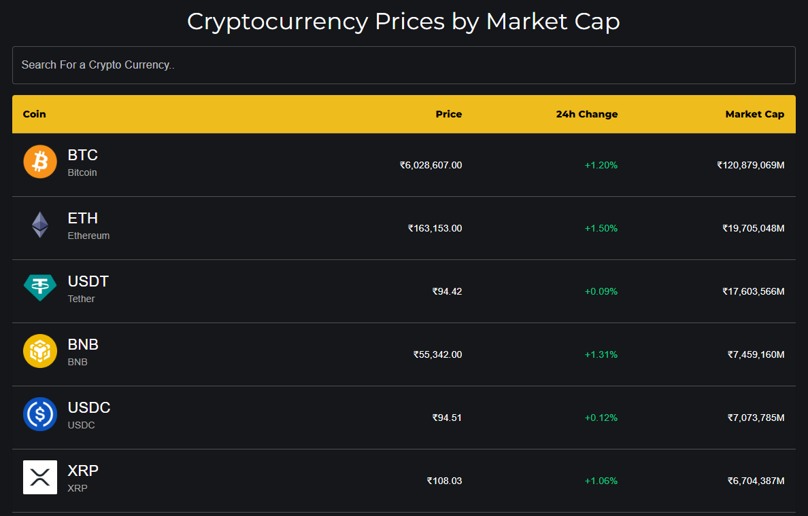
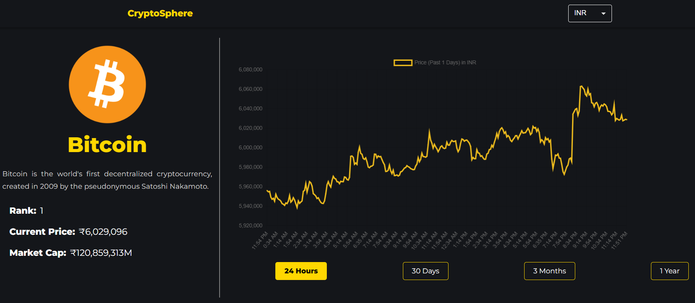

# CryptoSphere

CryptoSphere is a cryptocurrency tracking web application that provides real-time market data, detailed coin information, interactive price charts, and market insights. Users can explore cryptocurrency trends, monitor prices, and analyze historical performance through a clean and responsive interface.

---

## Live Demo

**Website:** https://cryptosphere-live.netlify.app

---

## Screenshots

### Homepage

```md

```
---

### Trending Cryptocurrencies

```md

```

---

### Cryptocurrency Details Page

```md

```

---

### Price Chart

```md

```

---

## Features

* Real-time cryptocurrency market tracking
* Detailed information for individual cryptocurrencies
* Interactive historical price charts
* Currency conversion support (USD / INR)
* Trending cryptocurrencies section
* Fully responsive design
* Modern and user-friendly interface
* Fast loading and optimized performance
* Search functionality for cryptocurrencies
* Historical price analysis

---

## Tech Stack

### Frontend

* React.js
* React Router DOM
* Material UI (MUI)
* Axios
* Chart.js
* React ChartJS 2
* HTML React Parser

### Deployment

* Netlify

---

## Project Structure

```text
src
│
├── components
│   ├── Banner
│   ├── CoinInfo
│   ├── CoinsTable
│   ├── Header
│   ├── Carousel
│   └── SelectButton
│
├── Pages
│   ├── Homepage
│   └── CoinPage
│
├── config
│   ├── api.js
│   └── data.js
│
├── CryptoContext.js
├── App.js
├── index.js
└── index.css
```

---

## Key Functionalities

### Cryptocurrency Market Overview

* Live cryptocurrency listings
* Market capitalization tracking
* Price monitoring
* 24-hour percentage changes

### Detailed Coin Analysis

* Coin description
* Market rank
* Current price
* Market capitalization
* Historical performance data

### Interactive Charts

* 24 Hours
* 30 Days
* 90 Days
* 1 Year

Historical chart visualization powered by Chart.js.

---

## Responsive Design

The application is optimized for:

* Desktop Devices
* Laptops
* Tablets
* Mobile Phones

---

## Future Enhancements

* User Authentication
* Watchlist Feature
* Portfolio Tracking
* Dark/Light Theme Toggle
* Price Alerts
* News Integration
* Advanced Analytics Dashboard

---

## Contributing

Contributions are welcome.

1. Fork the repository
2. Create a feature branch
3. Commit your changes
4. Push the branch
5. Create a Pull Request

---

## Author

**Rahul Gupta**

Python Full Stack Developer

GitHub: https://github.com/rahulgupta-cse/cryptosphere.git

---
